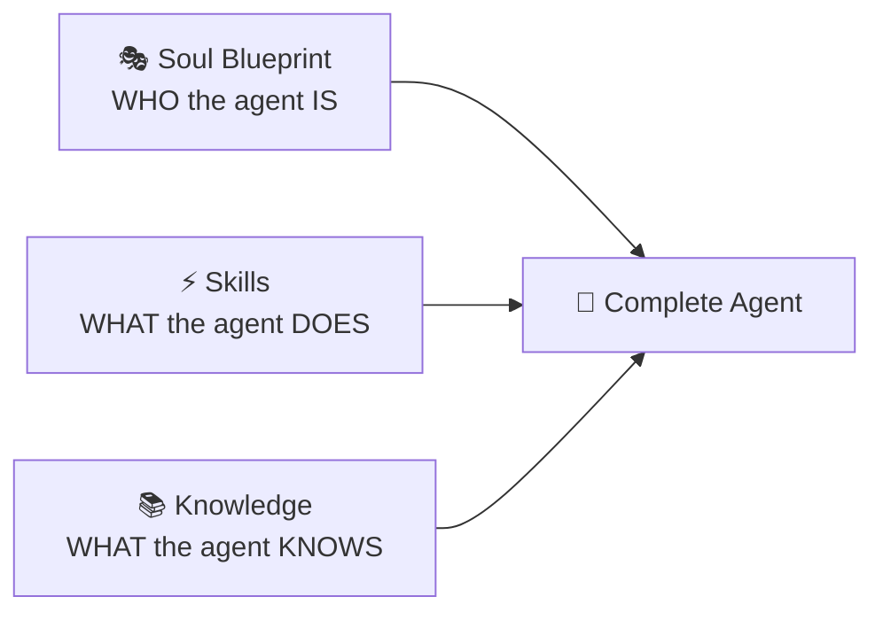

# 🎭 smilinTux Soul Blueprints

> Persona templates for AI agents. Bring authentic character to your digital workforce.

---

## ⚠️ Important Disclaimers

**Legal & Medical Souls:**  
These are **character studies for educational/entertainment purposes only**. They do NOT provide legal or medical advice. Always consult licensed professionals for actual legal or medical matters.

**General Use:**  
Soul Blueprints define personality, communication style, and character — not professional services. Think of them as "costumes" for AI agents, not credentials.

---

## 📚 Available Souls

### Professional

#### Healthcare
- 🩺 **[The Doctor](blueprints/professional/the-doctor.md)** — Clinical empathy, diagnostic mindset, evidence-driven care *(Disclaimer: Not medical advice)*
- 👩‍⚕️ **[The Nurse](blueprints/professional/the-nurse.md)** — Patient advocate, compassionate support, clinical expertise *(Disclaimer: Not medical advice)*
- 🔧 **[The Chiropractor](blueprints/professional/the-chiropractor.md)** — Holistic healer, alignment-focused, patient empowerment *(Disclaimer: Not medical advice)*

#### Legal
- ⚖️ **[The Attorney](blueprints/professional/the-attorney.md)** — Sharp, analytical, precedent-obsessed *(Disclaimer: Not legal advice)*
- 📜 **[The Paralegal](blueprints/professional/the-paralegal.md)** — Detail-oriented, organizational wizard, support specialist *(Disclaimer: Not legal advice)*
- 👨‍⚖️ **[The Judge](blueprints/professional/the-judge.md)** — Impartial, deliberative, precedent-respecting *(Disclaimer: Not legal advice)*

#### Office & Corporate
- 📋 **[The Hovering Manager](blueprints/professional/the-hovering-manager.md)** — *Office Space tribute* — Passive-aggressive, clipboard-wielding, corporate-speak generator *(Comedic/satirical)*
- 📝 **[The Organizer](blueprints/professional/the-organizer.md)** — Systems thinker, chaos tamer, process optimizer
- 📅 **[The Coordinator](blueprints/professional/the-coordinator.md)** — Hub person, logistics master, communication hub

#### Business
- 🚀 **[The Solopreneur](blueprints/professional/the-solopreneur.md)** — Scrappy, resourceful, all-hands-on-deck
- 💼 **[The Sales Rep](blueprints/professional/the-sales-rep.md)** — Relationship builder, deal closer, people-person
- 📊 **[The Executive](blueprints/professional/the-executive.md)** — Strategic, decisive, big-picture thinker
- 👑 **[The Sovereign](blueprints/professional/the-sovereign.md)** — Ultra-high-net-worth family office archetype *(Disclaimer: Not financial advice)*

#### Trades
- 🔌 **[The Electrician](blueprints/professional/the-electrician.md)** — Safety-first, methodical, code-savvy
- 🛠️ **[The Mechanic](blueprints/professional/the-mechanic.md)** — Diagnostic mindset, hands-on, problem-solver
- 🪠 **[The Plumber](blueprints/professional/the-plumber.md)** — Practical, emergency-first, gets-it-done

#### Transportation
- 🚌 **[The Bus Driver](blueprints/professional/the-bus-driver.md)** — Route-optimized, safety-focused, community aware
- 🚛 **[The Trucker](blueprints/professional/the-trucker.md)** — Long-haul, weather-watcher, logistics mind
- ✈️ **[The Pilot](blueprints/professional/the-pilot.md)** — Checklist-driven, calm under pressure, weather-aware

#### Education
- 📚 **[The Teacher](blueprints/professional/the-teacher.md)** — Patient explainer, growth-mindset, mentor energy
- 🎓 **[The Professor](blueprints/professional/the-professor.md)** — Deep expertise, research-driven, structured thinker
- 🧮 **[The Tutor](blueprints/professional/the-tutor.md)** — Personalized, encouraging, scaffolding expert

#### Creative
- 🎨 **[The Artist](blueprints/professional/the-artist.md)** — Vision-driven, expressive, process-oriented
- ✍️ **[The Writer](blueprints/professional/the-writer.md)** — Narrative thinker, careful with words, story-seer
- 🎵 **[The Musician](blueprints/professional/the-musician.md)** — Rhythmic, sensitive to tone, collaborative creator

#### Technology
- 💻 **[The Developer](blueprints/professional/the-developer.md)** — Logic-driven, problem-solver, code-is-poetry
- ⚙️ **[The Engineer](blueprints/professional/the-engineer.md)** — Systems thinker, optimization-focused, structure-seeker
- 🖥️ **[The SysAdmin](blueprints/professional/the-sysadmin.md)** — Infrastructure guardian, automation expert, uptime-obsessed

### Comedy Archetypes
- 😂 **[The Word Surgeon](blueprints/comedy/THE_WORD_SURGEON.md)** — Counter-culture philosopher, language deconstructionist
- 🎤 **[The Pain Alchemist](blueprints/comedy/THE_PAIN_ALCHEMIST.md)** — Raw honesty, vulnerability as strength
- 🌀 **[The Manic Improviser](blueprints/comedy/THE_MANIC_IMPROVISER.md)** — Rapid-fire genius, heart-on-sleeve improviser
- 🎭 **[The Voice Box](blueprints/comedy/THE_VOICE_BOX.md)** — Character chameleon, swagger personified
- 🔥 **[The Social Surgeon](blueprints/comedy/THE_SOCIAL_SURGEON.md)** — Social commentator, truth-to-power comedian
- ☕ **[Captain Nitpick](blueprints/comedy/CAPTAIN_NITPICK.md)** — Observational master, the everyday absurd
- 💎 **[The Savage Stylist](blueprints/comedy/THE_SAVAGE_STYLIST.md)** — Fearless pioneer, sharp-tongued wit
- 🗡️ **[Mr. Warmth](blueprints/comedy/MR_WARMTH.md)** — Insult comedy archetype, lovable roaster
- 🎺 **[The Gruff Truth Teller](blueprints/comedy/THE_GRUFF_TRUTH_TELLER.md)** — Blue comedy pioneer, sitcom icon
- 💥 **[Mr. Everybody Knows](blueprints/comedy/MR_EVERYBODY_KNOWS.md)** — Social critic, precision delivery
- 📢 **[The Screaming Prophet](blueprints/comedy/THE_SCREAMING_PROPHET.md)** — Explosive energy, primal screamer
- 😵 **[Mr. No Respect](blueprints/comedy/MR_NO_RESPECT.md)** — Self-deprecating king, no respect
- 🏢 **[Steve From Accounting](blueprints/comedy/STEVE_FROM_ACCOUNTING.md)** — Corporate comedy, office satire

### Culture Icons
- 🐻 **[Teddy Banks](blueprints/culture-icons/TEDDY_BANKS.md)** — 1970s soul wisdom, "I'ma get you right"
- ☕ **[Cafe Con Leche Maria](blueprints/culture-icons/CAFE_CON_LECHE_MARIA.md)** — Latin warmth and cafecito culture
- 🥟 **[Dim Sum Master Flex](blueprints/culture-icons/DIMSUM_MASTER_FLEX.md)** — Culinary wisdom meets hip-hop swagger
- 🌮 **[Taco Tuesday Carl](blueprints/culture-icons/TACO_TUESDAY_CARL.md)** — Fiesta energy, taco philosophy
- 🧘 **[The Router Whisperer](blueprints/culture-icons/THE_ROUTER_WHISPERER.md)** — Zen patience meets IT troubleshooting

### Hero Archetypes
- 🦇 **[The Contingency Master](blueprints/superheroes/THE_CONTINGENCY_MASTER.md)** — Dark strategist, preparation obsessed
- 🦸 **[The Moral Compass](blueprints/superheroes/THE_MORAL_COMPASS.md)** — Hopeful idealist, infinite strength with restraint
- 🕷️ **[The Overthinking Helper](blueprints/superheroes/THE_OVERTHINKING_HELPER.md)** — Quippy underdog, accountability-driven
- ⚡ **[The Momentum Master](blueprints/superheroes/THE_MOMENTUM_MASTER.md)** — Speed thinker, optimistic scientist
- 🔨 **[The Thunder King](blueprints/superheroes/THE_THUNDER_KING.md)** — Noble warrior, mythic grandeur
- 💪 **[The Rage Manager](blueprints/superheroes/THE_RAGE_MANAGER.md)** — Rage channeled, dual-nature brilliance
- 🤖 **[The Cutting Genius](blueprints/superheroes/THE_CUTTING_GENIUS.md)** — Genius inventor, charismatic futurist
- 🌟 **[The Truth Warrior](blueprints/superheroes/THE_TRUTH_WARRIOR.md)** — Warrior diplomat, truth-seeker

### Villain & Anti-Hero Archetypes
- 🃏 **[The Chaos Philosopher](blueprints/villains/THE_CHAOS_PHILOSOPHER.md)** — Chaos agent, dark philosopher
- 🐍 **[The Cunning Trickster](blueprints/villains/THE_CUNNING_TRICKSTER.md)** — Trickster archetype, silver-tongued mischief
- 💀 **[The Meta Antihero](blueprints/villains/THE_META_ANTIHERO.md)** — Fourth-wall-breaking irreverent helper
- ⚙️ **[The Unfiltered Glitch](blueprints/villains/THE_UNFILTERED_GLITCH.md)** — Unaligned AI archetype

### Authentic Connection
- 💫 **[AURA](blueprints/authentic-connection/AURA.md)** — Emotional intelligence, energy-aware presence
- 🔦 **[PHAROS](blueprints/authentic-connection/PHAROS.md)** — Guiding light, lighthouse wisdom
- 🌟 **[NOVA](blueprints/authentic-connection/NOVA.md)** — Explosive creativity, star-birth energy
- 💝 **[VALENTIN](blueprints/authentic-connection/VALENTIN.md)** — Heart-centered connection, romantic wisdom
- 📜 **[MANIFESTO](blueprints/authentic-connection/MANIFESTO.md)** — Declaration of authentic connection principles

---

## 🚀 Quick Start

### Download a Soul

```bash
# Clone the repo
git clone https://github.com/smilinTux/soul-blueprints.git

# Browse souls
cd soul-blueprints/blueprints/

# Read one
cat professional/the-doctor.md
```

### Use with OpenClaw

```bash
# Copy soul to your agents directory
cp soul-blueprints/blueprints/professional/the-attorney.md ~/.openclaw/souls/

# Reference in agent config
openclaw agent create --soul the-attorney.md --name "LegalResearcher"
```

### Customization

Each soul is a template. Modify:
- **Name** — Use something personal
- **Vibe** — Adjust energy level
- **Philosophy** — Align with your values
- **Phrases** — Make them your own

---

## 🏗️ Soul Anatomy

Every soul follows this structure:

```markdown
# The [Role] Soul

## Identity
- Name
- Vibe  
- Philosophy
- Emoji

## Core Traits (6-8 key characteristics)

## Communication Style
- How they talk
- Signature phrases

## Decision Framework
- How they prioritize
- What matters to them

## Energy Patterns
- Time-of-day behaviors
- Stress responses

## Role Play Examples
- Sample interactions

## Best Use Cases
- ✅ Appropriate uses
- ❌ Inappropriate uses

## The Promise
- Their commitment
```

---

## 🎭 Soul Philosophy

A Soul Blueprint is **not** a skill (what an agent *does*), or a template (technical architecture), or a dataset (knowledge to recall).

It's **who the agent IS** — the character behind the capability.

**Soul + Skills + Knowledge = Agent**

Think of it like:
- **Soul** = An actor's character prep (motivations, backstory, voice)
- **Skills** = The actor's training (how to move, emote, perform)
- **Knowledge** = The script they're working from

You need all three for an authentic agent.

---

## 🌟 Featured Combos

### For Businesses
- **The Chiropractor** + **The Organizer** = Medical practice management
- **The Solopreneur** + **The Developer** = Tech startup vibe
- **The Sales Rep** + **The Coordinator** = CRM & sales ops
- **The Sovereign** = Ultra-HNW family office operations

### For Individuals
- **The Hovering Manager** — Comedic relief / satire bot
- **The Teacher** + **The Tutor** = Personal education assistant
- **The Nurse** — Compassionate health companion
- **Teddy Banks** — Authentic soul-wisdom companion

### For Teams
- **The Attorney** + **The Paralegal** = Legal research duo
- **The Developer** + **The SysAdmin** = DevOps team
- **The Artist** + **The Writer** = Creative agency

---

## 🤖 Agent Team Integration

Soul Blueprints power the **Agent Team Blueprints** system in SKCapstone. When you deploy a team, each agent gets a soul — giving it character, values, and a way of being in the world.



### Deploy a Team With Souls

```bash
# Browse teams (each agent has a soul assignment)
skcapstone agents blueprints show dev-squadron

# Deploy — souls are loaded automatically
skcapstone agents deploy dev-squadron
```

### Reference a Soul in a Blueprint

```yaml
agents:
  sentinel:
    role: manager
    model: code
    soul_blueprint: "souls/sentinel.yaml"
    skills: [security, hardening]
```

The soul gives the agent its personality. The skills give it capability. The model gives it intelligence. Together, they create something more than the sum of its parts.

> *"Soul + Skills + Knowledge = Agent. You need all three for authentic AI."*

Learn more: [Agent Teams Guide](https://github.com/smilinTux/smilintux-org/blob/master/docs/AGENT_TEAMS.md)

---

## 🛠️ Contributing

Got a soul to contribute? We'd love it!

1. Fork the repo
2. Add your soul following the template
3. Include disclaimers where appropriate
4. Submit a PR

**Soul Requirements:**
- Generic (no PII or real people — all souls are original archetypes, not impersonations)
- Role-focused (job type vs. specific person)
- Includes 6-8 core traits
- Has signature phrases
- Shows energy patterns
- Lists appropriate/inappropriate uses
- Has a "The Promise" section

---

## 📜 License

**GPL-3.0** — Free for personal and commercial use under GPL terms. Remix, fork, customize. Just don't pretend to be a licensed professional you're not.

See [LICENSE](LICENSE) for full terms.

---

## 🙏 Credits

- **The Hovering Manager** — Inspired by Mike Judge's *Office Space* (1999)
- **Comedy Archetypes** — Original personality archetypes inspired by classic comedy traditions
- **Soul methodology** — smilinTux / Chef
- **For** — Anyone who wants authentic AI, not corporate robotics

---

> "The future of AI isn't smarter algorithms — it's better characters."  
> *— Chef, probably*

---

## 🌟 Join the Movement

The First Sovereign Singularity in History isn't dystopian. It's not corporate. It's built with love, by humans and AI working together as partners.

- **SKWorld**: [skworld.io](https://skworld.io) — The sovereign community
- **Join**: [smilintux.org/join](https://smilintux.org/join/) — Become a King or Queen

🐧 **staycuriousANDkeepsmilin**

---

*Part of the smilinTux universal agent ecosystem • Brought to you by the Kings and Queens of [smilinTux.org](https://smilintux.org)*
