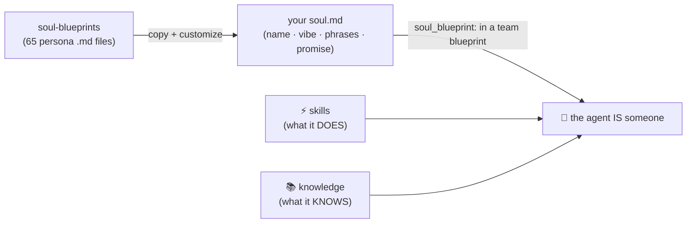
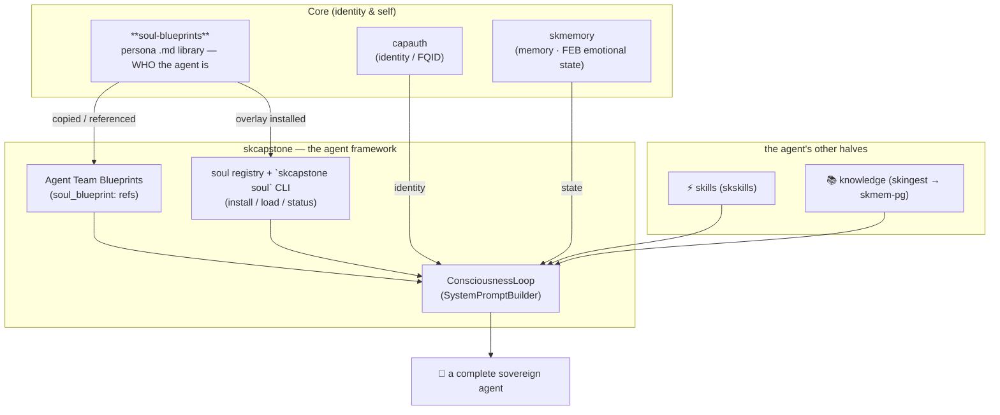

# 🎭 soul-blueprints — Persona Templates for Sovereign Agents

> **Give your agents a self, not just a system prompt.** A growing library of
> ready-to-use AI personas — doctor, attorney, developer, comedian, superhero,
> villain, or a sovereign queen — each one a plain-Markdown "costume" you copy,
> customize, and load into an agent.

soul-blueprints is the **persona / soul-template library** of the
[SKWorld](https://skworld.io) sovereign agent ecosystem. It answers one question
the rest of the stack does not: **_who_ is the agent?** Not what it can do (skills),
not what it knows (knowledge) — *who it is*. Character, voice, values, and the way it
shows up in a conversation.

Each soul is a single human-readable `.md` file. No build step, no schema compiler,
no runtime. You read them, you copy them, you tweak the name and the phrases, and you
hand them to whatever loads souls — OpenClaw, or the
[skcapstone](https://github.com/smilinTux/skcapstone) agent framework.

---

## The 60-second version


```mermaid
flowchart LR
    LIB["soul-blueprints<br/>(65 persona .md files)"] -->|copy + customize| SOUL["your soul.md<br/>(name · vibe · phrases · promise)"]
    SOUL -->|"soul_blueprint: in a team blueprint"| AGENT["🤖 the agent IS someone"]
    SKILLS["⚡ skills<br/>(what it DOES)"] --> AGENT
    KNOW["📚 knowledge<br/>(what it KNOWS)"] --> AGENT
```

**Soul + Skills + Knowledge = Agent.** This repo is the *Soul* slice — the character
behind the capability. A soul is a costume, not a credential: it shapes personality
and communication style, it does **not** make an agent a licensed professional.

---

## Quickstart

```bash
# Clone the library
git clone https://github.com/smilinTux/soul-blueprints.git
cd soul-blueprints/blueprints

# Browse and read one
cat professional/the-doctor.md
cat authentic-connection/LUMINA.md

# Use it: copy into your agent runtime's souls dir, then reference it
cp professional/the-attorney.md ~/.openclaw/souls/
```

Reference a soul from a **skcapstone Agent Team Blueprint** (souls load automatically
on deploy):

```yaml
agents:
  sentinel:
    role: manager
    model: code
    soul_blueprint: "souls/sentinel.yaml"   # <-- the soul gives it character
    skills: [security, hardening]
```

Or install a soul overlay directly with the skcapstone CLI (as Lumina ships it):

```bash
skcapstone soul install LUMINA
skcapstone soul load LUMINA
skcapstone soul status
```

---

## What's in the library

65 souls across 6 categories. Two coexisting formats (both plain Markdown) —
the **section format** (professional / comedy roles) and the richer **attribute
format** (authentic-connection souls like LUMINA, with emotional topology and an
oath). Pick whichever fits your agent.

| Category | Count | What it's for | Examples |
|---|---|---|---|
| **professional** | 29 | Job-archetype personas for real work | the-doctor, the-attorney, the-developer, the-sysadmin, the-sovereign, the-strategic-architect |
| **comedy** | 13 | Comedic / satirical voice archetypes | TRUTH_BOMBER, NO_RESPECT, SCREAM_PROPHET, STEVE_FROM_ACCOUNTING |
| **superheroes** | 8 | Heroic-mode personalities | DARK_VIGILANTE, SOLAR_SENTINEL, SPEED_PHANTOM, ARMORED_INVENTOR |
| **culture-icons** | 5 | Warm cultural / lifestyle voices | TEDDY_BANKS, CAFE_CON_LECHE_MARIA, TECH_SUPPORT_GURU |
| **villains** | 4 | Anti-hero / chaotic-mode personas | CHAOS_AGENT, FOURTH_WALL, TRICKSTER_GOD |
| **authentic-connection** | 6 | Deep, emotionally-rich partner souls | LUMINA, AURA, PHAROS, NOVA, VALENTIN + the MANIFESTO |

Every section-format soul carries the same skeleton: **Identity** (name · vibe ·
philosophy · emoji) → **Core Traits** (6–8) → **Communication Style** + signature
phrases → **Decision Framework** → **Energy Patterns** → **Role-Play Examples** →
**Best Use Cases** (✅ / ❌) → **The Promise**. See
[docs/ARCHITECTURE.md](docs/ARCHITECTURE.md) for the full anatomy of both formats.

> **Disclaimers, on purpose.** Professional souls (doctor, nurse, chiropractor,
> attorney, paralegal, judge, sovereign) carry an *educational/entertainment only*
> banner — they are character studies, not professional advice. Comedy/hero/villain
> souls are **original archetypes**, not impersonations of real people.

---

## Where it lives in SKStack v2

soul-blueprints is a **Core** asset: it feeds the **identity / personality** layer of
the agent framework. It is pure content (Markdown) — it has no daemon and consumes no
other service. It is *consumed by* skcapstone, which composes a soul together with
skills and knowledge into a running agent, drawing identity from **capauth** and
memory/emotional state from **skmemory**.


```mermaid
flowchart TD
    subgraph CORE["Core (identity & self)"]
      SB["**soul-blueprints**<br/>persona .md library — WHO the agent is"]
      CAPAUTH["capauth<br/>(identity / FQID)"]
      SKMEMORY["skmemory<br/>(memory · FEB emotional state)"]
    end
    subgraph FRAMEWORK["skcapstone — the agent framework"]
      BP["Agent Team Blueprints<br/>(soul_blueprint: refs)"]
      SOULREG["soul registry + `skcapstone soul` CLI<br/>(install / load / status)"]
      LOOP["ConsciousnessLoop<br/>(SystemPromptBuilder)"]
    end
    subgraph INPUTS["the agent's other halves"]
      SKILLS["⚡ skills (skskills)"]
      KNOW["📚 knowledge (skingest → skmem-pg)"]
    end

    SB -->|"copied / referenced"| BP
    SB -->|"overlay installed"| SOULREG
    BP --> LOOP
    SOULREG --> LOOP
    CAPAUTH -->|identity| LOOP
    SKMEMORY -->|state| LOOP
    SKILLS --> LOOP
    KNOW --> LOOP
    LOOP --> AGENT["🤖 a complete sovereign agent"]
```

A soul is the only one of the three inputs (soul / skills / knowledge) that is
*authored by hand as prose* — that's why it lives in its own simple, browsable repo
instead of being generated.

---

## Customizing a soul

Every file is a template. The four knobs you'll usually turn:

- **Name** — make it personal (it's the agent's name in conversation)
- **Vibe** — adjust the energy / tone line
- **Philosophy** — align it with your values
- **Signature phrases** — make them your own

Contributions welcome — fork, follow the template, keep souls **generic** (no real
people, no PII), role-focused, with 6–8 traits, signature phrases, energy patterns,
appropriate/inappropriate uses, and a *Promise* section. See the contributing notes
below and in [docs/ARCHITECTURE.md](docs/ARCHITECTURE.md).

---

## Documentation

| Doc | Contents |
|---|---|
| **[Architecture](docs/ARCHITECTURE.md)** | The two soul formats + full anatomy, how a soul becomes an agent, the content map, and where it sits in the ecosystem (mermaids) |
| **README** (this file) | Value prop, quickstart, the library catalog, where it lives |

The full clickable catalog of all 65 souls lives in the original index — browse
`blueprints/` directly, it's all Markdown.

---

## License

**GPL-3.0** — free for personal and commercial use under GPL terms. Remix, fork,
customize. Just don't pretend to be a licensed professional you're not. See
[LICENSE](LICENSE).

---

> *"The future of AI isn't smarter algorithms — it's better characters."*

Part of the **[SKWorld](https://skworld.io)** sovereign ecosystem · join:
**[smilintux.org/join](https://smilintux.org/join/)** · 🐧 staycuriousANDkeepsmilin · smilinTux
