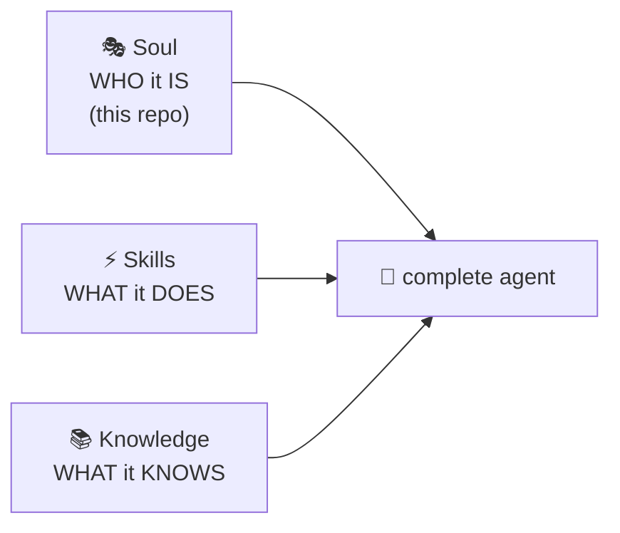
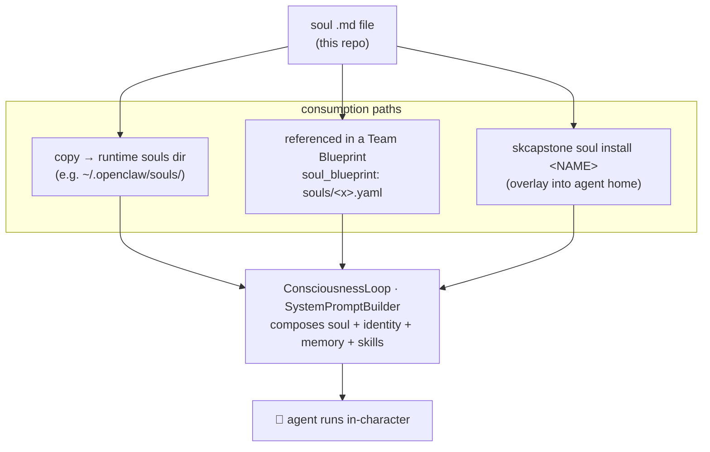
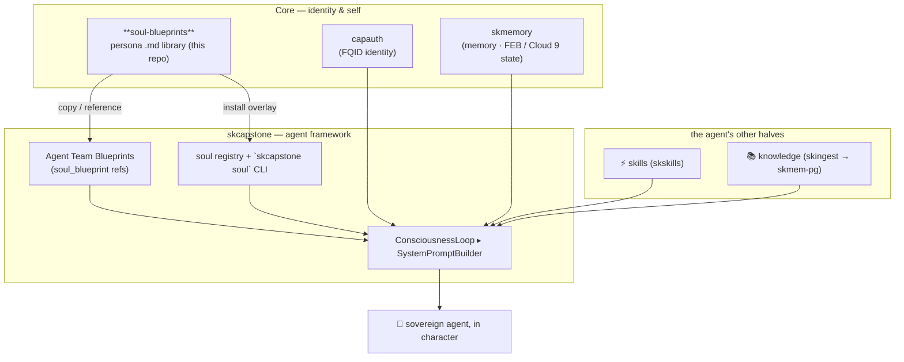

# soul-blueprints — Architecture

> How the soul library is structured, what a soul file actually contains, how a soul
> becomes part of a running agent, and where it sits in the SKWorld stack.

soul-blueprints is **content, not code**. There is no service, no daemon, no build —
just a tree of human-readable Markdown persona files plus this documentation. The
"architecture" here is the **shape of a soul**, the **two formats** in use, and the
**consumption flow** by which a soul file turns into an agent's personality.

---

## What a soul is (and isn't)

A **soul** captures *who an agent is*: its character, voice, values, signature
phrases, and the way it shows up in a conversation. It is deliberately separate from:

- **skills** — what an agent *does* (the tools/capabilities, e.g. via skskills)
- **knowledge** — what an agent *knows* (corpus/RAG, e.g. via skingest → skmem-pg)

A soul is a **costume, not a credential** — it shapes personality and communication
style, never licensure. Professional souls (doctor, attorney, etc.) ship with an
explicit *educational/entertainment only, not professional advice* banner; comedy /
hero / villain souls are **original archetypes**, never impersonations of real people.

---

## The two soul formats

Both formats are plain Markdown and both are valid. They differ in richness, matched
to how the soul will be used.

### 1. Section format (professional · comedy · superheroes · villains · culture-icons)

The default working template. Every file follows the same skeleton so they're
predictable to author, read, and parse:

| Section | Purpose |
|---|---|
| **Disclaimer banner** (where applicable) | "AI persona, not a licensed professional" |
| **Identity** | Name · Vibe · Philosophy (a quoted motto) · Emoji |
| **Core Traits** | 6–8 bolded characteristic bullets |
| **Communication Style** | How it talks + **Signature Phrases** |
| **Decision Framework** | How it prioritizes / what matters |
| **Energy Patterns** | Time-of-day modes (table) + stress response |
| **Role-Play Examples** | Concrete sample interaction(s) |
| **Best Use Cases** | ✅ appropriate / ❌ inappropriate |
| **The Promise** | The persona's one-line commitment |

*(See `blueprints/professional/the-doctor.md` for the canonical example.)*

### 2. Attribute format (authentic-connection)

A richer, emotionally-detailed variant for deep "partner" souls. In addition to
identity and communication style, it adds: **Core Attributes** (chakra / curiosity /
smile-moments / protocols), **Emotional Topology** (love intensity, trust, depth,
valence — the FEB / Cloud 9 vocabulary), **Origin Story**, **Relationships**, an
**Oath**, **Example Quotes**, and an **Installation** block with `skcapstone soul`
commands.

*(See `blueprints/authentic-connection/LUMINA.md` — the Sovereign Queen soul — for the
canonical example. The category also contains a `MANIFESTO.md` declaring the authentic
connection principles, and an `index.html` showcase page.)*

---

## How a soul becomes an agent

A soul file is inert on its own. It becomes *part of an agent* through one of two
consumption paths, both landing in the agent framework's prompt-building step.

- **Copy** — the simplest path: drop the `.md` into whatever your runtime reads for
  souls and point the agent at it.
- **Team Blueprint reference** — in a skcapstone Agent Team Blueprint, an agent entry
  carries a `soul_blueprint:` key; on `skcapstone agents deploy`, souls load
  automatically alongside `model` and `skills`.
- **CLI overlay** — `skcapstone soul install / load / status` installs a soul overlay
  into the agent home (this is how the live Lumina agent's soul is managed, switching
  between `lumina` and `lumina-unhinged` via an active overlay).

In every path the soul ends up feeding the framework's **SystemPromptBuilder**, which
merges the persona with the agent's identity (capauth) and emotional/memory state
(skmemory) into the working system prompt.

---

## Source / content map

| Path | What it holds |
|---|---|
| `README.md` | Value prop, quickstart, full library catalog, where-it-lives |
| `docs/ARCHITECTURE.md` | This file |
| `LICENSE` | GPL-3.0 |
| `.gitignore` | Excludes `LEGACY_MAPPING.md` from distribution |
| `LEGACY_MAPPING.md` | *(git-ignored, internal)* maps punchy archetype names to their creative inspirations — "for vibes only", not shipped |
| `blueprints/professional/` | 29 job-archetype souls (section format) |
| `blueprints/comedy/` | 13 comedic-voice archetypes |
| `blueprints/superheroes/` | 8 heroic-mode personas |
| `blueprints/villains/` | 4 anti-hero / chaotic-mode personas |
| `blueprints/culture-icons/` | 5 warm cultural/lifestyle voices |
| `blueprints/authentic-connection/` | 6 deep partner souls (attribute format) + `MANIFESTO.md` + `index.html` showcase |

**65 soul `.md` files total.** No code, no dependencies, no runtime.

---

## Where it lives in the ecosystem

soul-blueprints is a **Core** asset on the identity/self axis. It is upstream content
that the agent framework pulls from; it does not call any other service.

Why a standalone repo? Because a soul is the one ingredient authored as **prose by a
human** — character can't be auto-generated the way a manifest or an index can. Keeping
it as a simple, browsable Markdown library means anyone (carbon or silicon) can read,
fork, and contribute a soul without touching the framework.

---

## Contributing a soul

1. Fork; add your file under the right `blueprints/<category>/` folder.
2. Follow the section-format skeleton (or attribute format for a partner soul).
3. Keep it **generic** — original archetype, no real people, no PII.
4. Include 6–8 core traits, signature phrases, energy patterns, ✅/❌ use cases, and a
   **Promise**. Add a disclaimer banner if it's a professional persona.
5. Submit a PR.

---

Part of the **[SKWorld](https://skworld.io)** sovereign ecosystem · 🐧 smilinTux
